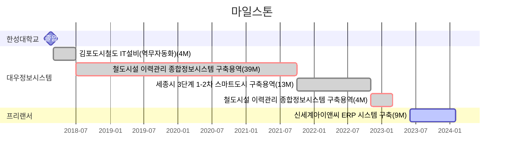

---
# the default layout is 'page'
icon: fas fa-info-circle
order: 4
mermaid: true
---

<!-- 
> Add Markdown syntax content to file `_tabs/about.md`{: .filepath } and it will show up on this page.
{: .prompt-tip } 
-->

# 🙋‍♂️About Me

## Introduction

??사진
??이름
??직업

* 안녕하세요! 5년차 개발자 김기태입니다.

* 개발을 좋아하는...
* 등산.

## Contact & Channel

* **Email** gtgt.kim@kakao.com
* **Github** [https://github.com/gim224](https://github.com/gim224 "github")
* **Blog** [https://gim224.github.io](https://gim224.github.io "blog")

# 💻Skills

`JavaScript`  `React`  `Java`  `Spring Boot`

<!-- 
## Collaboration & Tools
* VS Code
-->

# 💬Work Experience & Projects

| 프로젝트명 | 내용 | 기간 |
|:---|:---|---:|
| **신세계아이앤씨 ERP 시스템 구축**   | SAP    UI5, ABAP   | 2023.06 ~ 2024.02   |
| **철도시설 이력관리 종합정보시스템 구축용역**   |    Java, Spring Framework   | 2022.11 ~ 2023.03   |
| **세종시 3단계 1-2차 스마트도시 구축용역**   |    React, Java, Spring Framework   | 2021.10 ~ 2022.10   |
| **철도시설 이력관리 종합정보시스템 구축용역**   |    Java, Spring Framework   | 2018.07 ~ 2021.09   |
| **김포도시철도 IT설비(역무자동화)**   | 인턴십      | 2018.03 ~ 2018.06   |

# 💭Personal Experience & Projects

| 프로젝트명 | 내용 | 기간 |
|:---|:---|---:|
| [**수주내역 분석 프로그램**](https://gim224.github.io/posts/%EC%88%98%EC%A3%BC%EB%82%B4%EC%97%AD-%EB%B6%84%EC%84%9D-%ED%94%84%EB%A1%9C%EA%B7%B8%EB%9E%A8/)   |    Python | ?? 2023.11. ~ 2023.12.   |
| **온습도알리미**   |    Raspberry Pi, Spring Boot, Python | ?? 2018.06. ~ 2018.06.   |

<!-- 
# 🗣️Presentaion & Article 
-->

# 🏫Education

| 교육명 | 내용 | 기간 |
|:---|:---|---:|
| [**우아한테크캠프 Pro**](https://edu.nextstep.camp/c/lqsBs7x0/ "nextstep")| 사설교육｜2기 | 2021.5.17 ~ 2021.7.16   수료 |
| **한성대학교** | 대학교(학사)｜컴퓨터공학과 | 2012.03. ~ 2018.02.   졸업 |

# 🏆Certificate

| 자격/수상명 | 구분 | 발행처/기관 | 일자 |
|:---|:---:|:---|---:|
| **SQL개발자(SQLD자격)** | 자격증 | 한국데이터베이스진흥센터 | 2019.09 |
| **AI산업컨설턴트** | 자격증 | 한국인공지능협회 | 2019.05 |
| **정보처리기사** | 자격증 | 한국산업인력공단 | 2018.08 |
| **SK청년비상 IoT해커톤/은상** | 수상내역/공모전 | 한성대학교창업지원단장 | 2017.07 |
| **정보처리기능사** | 자격증 | 한국산업인력공단 | 2007.10 |
| **컴퓨터활용능력2급** | 자격증 | 대한상공회의소 | 2006.05 |

# 🎯Goal
    
1. [Product-Minded Engineer; 제품 중심 개발자](https://www.integer.blog/product-minded-engineer/) 
   
   * 문제를 해결하기 위해 개발 내외로 끊임없이 고민하는 사람.    

2. [개발 교육자](https://youtu.be/ccXMdSM1IRo?si=CgDzUrCjs9p7z4xP)
   
   * 정답이 명확하지 않은 개발에서 최선책을 찾기 위해 정진하는 사람. 
   * 서로가 같이 성장할 수 있는 환경을 만드는 사람.

> 다른 사람을 가르치려면 머릿속 정보를 재구성해야 하고 
> 머릿속에 흩어져 있는 정보를 이해하기 쉬운 형태로 만들어야 한다. 
> 즉, 다른 누군가를 가르치려면 자신을 먼저 가르쳐야 하고 
> 이 과정에서 성장하는 자신을 발견할 수 있는 것이다.
